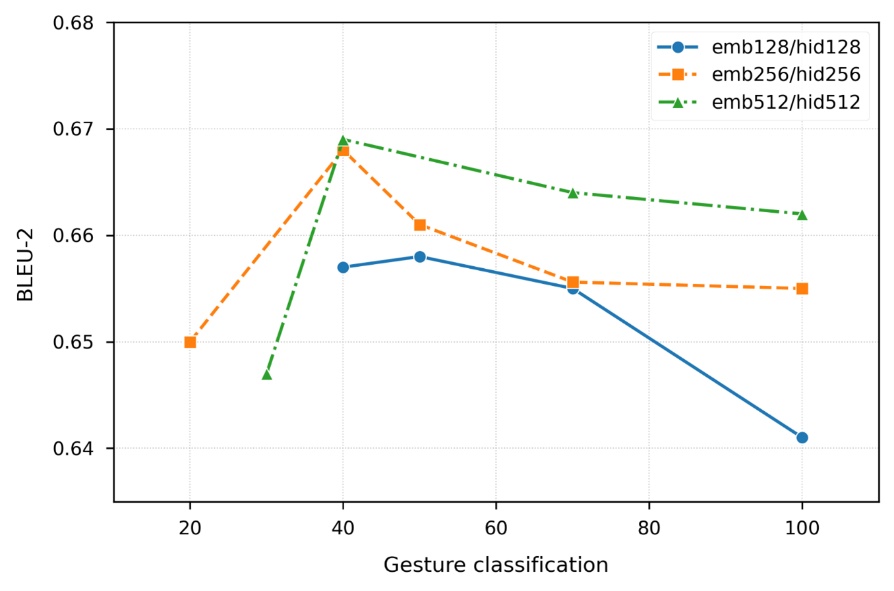
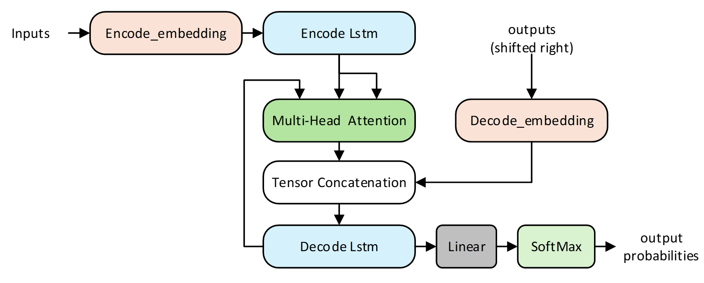
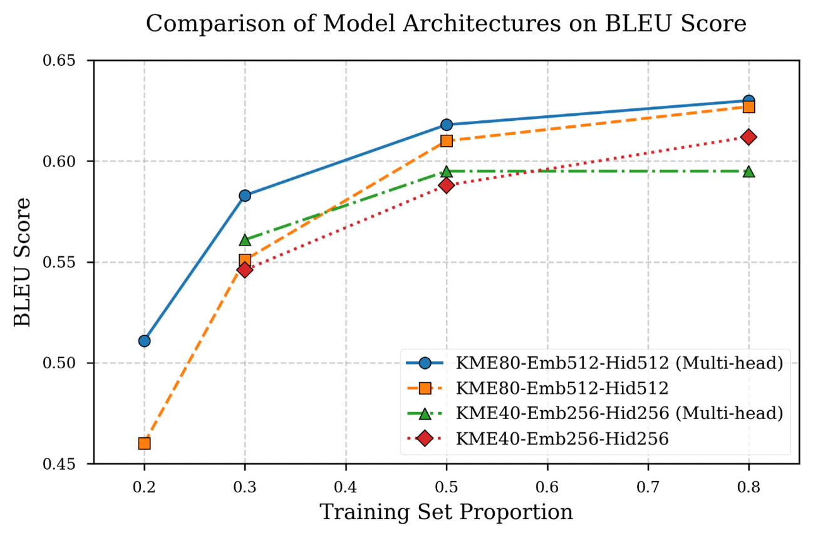

Xuanmen_Net 是一个基于 PyTorch 的先进手语翻译模型，
融合了最先进的mediapipe技术，提供高精度手语翻译能力。本仓库不仅包含推理演示，
还提供完整的训练框架，用户可轻松自定义训练自己的手语翻译模型。

主要特性：

* 支持手语检测，分类，翻译一体化
* 支持自定义训练集一键训练
* 优化后的轻量架构可以在边缘设备上进行快速计算
* 提供flask部署方案

快速开始：
<details open>
<summary><h2>📖 环境配置</h2></summary>

### 克隆代码仓库并在Python3.10版本的环境中安装依赖项，请确保已安装cuda12.3及以上版本。推荐使用Python3.10.16+cuda12.3的搭配。
- 支持多级嵌套
- 显示代码、列表、图片等任意内容
```python
#克隆代码仓库
git clone https://github.com/galijiangzhi/xuanmen.git

#导航至项目目录
cd xuanmen

#安装必要的依赖库
pip install -r requirements.txt
```
</details>
<details open>
<summary><h2>📖 快速运行demo</h2></summary>

### 我们提供了建议的demo用于展示结果，请确保已完成环境配置后执行以下代码运行示例程序

```python
#确保当前路径为git项目根文件夹
pwd

#导航至demo程序目录
cd demo/flask

#运行demo程序
python main.py
```

等待后端程序启动之后，通过浏览器访问 http://127.0.0.1:5000 可以打开demo测试页面，前端结构[如图所示（点击查看）](https://github.com/galijiangzhi/xuanmen/blob/main/information/demo_%E5%89%8D%E7%AB%AF%E7%A4%BA%E6%84%8F%E5%9B%BE.png)。

模型选择建议使用 km40-emb256-hid256_双手分离_抽帧1，
同时我们提供了一些测试视频，测试视频根路径为 'xuanmen/demo/demo_data'，
这些测试视频会在克隆代码仓库的时候一并克隆到本地。

</details>
<details open>
<summary><h2>📖 训练模型</h2></summary>

### 本指南介绍如何使用 Xuanmen_Net模型 训练您自己的自定义数据集。训练自定义模型是定制手语翻译解决方案的基本步骤。

## 开始之前

首先，确保您已建立必要的环境。克隆Xuanmen_Net代码仓库，配置python3.10环境 并从 requirements.txt 中安装必要的依赖库，
同时训练神经网络的gpu环境也是必要的。推荐使用Python3.10.16+cuda12.3的搭配，pytorch版本在requirements.txt有定义，
在安装依赖库列表时会自动安装搭配推荐环境使用的pytorch环境。

```python
git clone https://github.com/galijiangzhi/xuanmen.git
cd xuanmen
pip install -r requirements.txt
```

开发自定义手语识别模型是一个复杂过程：
* 收集和整理视频数据：收集与特定任务相关的高质量手语视频数据。
* 整理数据：按照手语的含义对视频数据进行分类，并创建folder-label对照表，该表用于进行’文件夹名‘-'手语含义'映射。
* 手语序列提取：将全部的手语数据进行汇总，训练kmeans聚类网络对对高维手部轨迹进行编码，获得紧凑的类别化表示
* 训练序列翻译网络：训练seq2seq网络，将类别化表示的手部动作序列翻译为目标语言
* 部署与预测：利用训练后的模型对未见过的手部序列进行推理
* 收集边缘案例：找出模型表现不佳的情况，将类似数据添加到数据集中，以提高模型性能，循环训练。

我们为训练自定义手语模型过程提供了的代码，包括手部序列提取，kmeans模型训练，手部序列类别化，seq2seq网络训练等。
<details open>
<summary><h3>✏️ 1.创建数据集</h3></summary>

Xuanmen_Net模型需要整理好的数据来学习手语的特征，正确地整理手语视频数据是模型训练的关键。

用户需按以下规则整理手语数据：

```python
dataset/
├── 000000/         # 存放第一类语义的视频，如'他的同学是教师‘，内部视频文件名随意
│   ├── 1.mp4    
│   ├── 2.mp4    
│   ├── 3.mp4    
│   └── ...
├── 000001/         # 存放第一类语义的视频，如'我买了苹果‘，内部视频文件名随意
│   ├── 1.mp4    
│   ├── 2.mp4    
│   ├── 3.mp4    
│   └── ...
└── corpus.txt      # 标签映射文件
```

标签映射文件格式:

```python
000000 他的同学是警察
000001 他妈妈的同学是公务员
000002 我的爸爸是商人
000003 他哥哥的目标是解放军
```

## 标签映射文件字段说明：

* 前六位数字：必须与视频父文件夹名严格匹配
* 文本内容：描述对应文件夹下所有视频的含义

## 数据集建议

* 每个标签至少50个视频样本
* 单视频时长5-10秒
* 手部动作不宜过快，最佳速度为12cm/s-18cm/s
</details>
<details open>
<summary><h3>✏️ 2.模型参数选择</h3></summary>

设置一套参数来启动训练过程，对于不同的应用场景选择不同的参数可以有效提高系统的结果，
Xuanmen_Net在实验阶段测试了一系列模型参数，每种模型都能在速度和准确性之前取得不同的平衡。

## 🎯核心参数说明

|参数名称	|可选范围	|影响说明|
| :---: | :---: | :---: |
|聚类数 (K)	|20-100	|值越大手势分类越细，但超过峰值后收益递减（实验数据集阈值为50）
|嵌入维度	|128/256/512	|影响特征表达能力，512维在多数场景最优但计算量较大
|隐藏层维度	|通常与嵌入维度相同	|决定LSTM记忆容量，与嵌入维度同步调整
|双手处理	|合并/独立	|独立处理精度高5-8%，但计算量翻倍
|抽帧间隔	|1-7帧	|间隔1~3时最佳（实验数据集间隔3效果最好计算量减少67%且BLEU提升0.8%）

## 💻 场景化推荐配置

|     配置类型      | 聚类数 | 嵌入维度 | 隐藏层 | 双手处理 | 抽帧间隔 | 预期效果        |
|:-------------:|:--------:|:----------:|:--------:|:----------:|:----------:|:-------------:|
| 移动端APP (轻量型)  | 40     | 128      | 128    | 合并     | 5        | BLEU2≈0.64  |
| 移动端APP (平衡型)  | 50     | 256      | 256    | 独立     | 3        | BLEU2≈0.66  |
|  桌面级应用 (高性能)  | 80     | 512      | 512    | 独立     | 1        | BLEU2≈0.669 |


## ⚙️ 高级调参建议

### 数据量较小时：
* 启用多头注意力 (multi-head=True)，适当降低聚类数 (K=30-40)，可提升小数据场景效果11%

### 实时性要求高时：

```python
# 在config.yaml中调整
sampling_interval: 5  # 抽帧间隔
hands_model: True     # 双手合并
```
### 精度优先时：
```python
多头: True  
embedding_dim: 512
cluster_num: 80
```
</details>
<details open>

<summary><h3>✏️ 3.整理目录</h3></summary>

## 构建您的数据集目录

推荐的目录结构为

```
xuanmen(git代码仓库根路径）
└── SLR_dataset/  # 数据根路径
    ├── color/   #视频数据路径
    │   ├── 000000/  # 存放第一类语义的视频，如'他的同学是教师‘，内部视频文件名随意
    │   │   ├── 1.avi
    │   │   ├── 2.avi
    │   │   └── ...
    │   ├── 000001/  # 存放第二类语义的视频，如'我的毛巾是干的‘，内部视频文件名随意
    │   │   ├── 1.avi
    │   │   ├── 2.avi
    │   │   └── ...
    │   └── ...
    │
    ├── kme_seq/   #kmean聚类后的序列文件夹
    │
    ├── model/   #模型存放文件夹
    │
    ├── seq_txt/   #视频序列化存储文件夹
    │
    └──corpus.txt   # label——folder映射文件

```
</details>
<details open>

<summary><h3>✏️ 4.修改配置文件</h3></summary>

## Xuanmen_Net项目需要配置合理的参数用于开发自定义手语识别模型，正确编写参数文件是关键

### 配置文件概述了数据集的结构，序列翻译模型定义的，手势提取模型的结构以及关键文件的路径，并且还有一个流程表用于控制项目只运行某些模块。

默认的示例配置文件 **scripts/config/config.yaml** 文件包括：

* model: 包含双手模式,取样区间，手势类别，序列长度，多头模式，词向量维度，隐藏层维度，n_layers，以及多头的数量。
* train: 包括训练批次和批次大小
* mediapipe: 手势提取网络的关键参数，与mediapipe类的定义一致
* 流程:控制每个步骤是否要进行运行
* 数据清洗: 控制特征提取后的文件过滤，删除零值过高的数据以保证数据的高质量
* 计算参数:控制最大进程数
* path: 记录关键路径，如数据集视频路径，数据序列路径，模型路径等

以下是默认配置文件config.yaml[(在GitHub上查看)](https://github.com/galijiangzhi/xuanmen/blob/main/scripts/config/config.yaml)，其中标注带双星号（**）的为需要注意修改项:

```yaml
model:
  双手合并: True  #** true为双手合并表示，false为双手分离表示
  取样区间: 1     #** 该参数用于控制每多少帧取一帧，1表示每帧都取，2表示每2帧取1帧
  kmeans类别: 40  #** 手势分类的类别数
  kmeans训练批次大小: 5000  #训练kmeans时的批次大小，根据内存大小设置即可，5000为内存16g的参考值
  不抽帧双手分离seq最大长度: 800 #** 设置默认情况下单个手势的最长帧率，计算方式为 最长视频时间*帧率*2
  多头: False #** 是否启用多头网络
  词向量维度: 512 #** 设置词向量维度
  LSTM隐藏层维度: 512 #** 设置隐藏层维度
  n_layers: 1 #** 设置网络深度
  num_heads: 8 #设置多头的数量，如果不使用多头则掠过

train:
  epoch: 10 #** 训练次数
  batch_size: 128 #** 批次大小

mediapipe:
  static_image_mode: False # 视频流模式（跟踪优先）
  max_num_hands: 2  # 最多检测2只手
  model_complexity: 1  # 中等复杂度模型
  min_detection_confidence: 0.4  # 检测置信度阈值较高
  min_tracking_confidence: 0.3  # 跟踪置信度阈值

流程:
  video2txt: False #** 流程控制：是否要进行图像特征提取，将每个视频提取为数字序列 每个文件形状为 帧率*2*63（双手分离） 或者 帧率*126(双手合并）
  数据零值比例过滤: False #** 流程控制：是否要对提取到的数字序列进行过滤，删除零值过高的数据
  整合合理数据: False #** 流程控制：是否要将所有的数字序列合并到一个文件夹，该流程是kmeans训练的必要流程
  kmeans模型训练: False #** 流程控制：是否要训练kmeans模型
  kmeans对原数据进行处理: False #** 流程控制：是否要使用kmeans模型对数字序列进行降维
  xuanmen网络训练: True #** 流程控制：是否要训练‘翻译网络’


数据清洗:
  零值比例阈值: 0.74 #零值比例过滤参数，非零值低于该值的数据将被定义为低质量数据被删除

计算参数:
  max_workers: 6 #程序最大进程数量

path:
  dataset_video_path: './SLR_dataset/color' #** 数据集视频地址
  dataset_seq_path: './SLR_dataset/seq_txt' #** 数据集特征提取之后的保存地址
  双手合并全部数据npy_path: './SLR_dataset/准确率正常的全部数据_双手合并.npy' #** 双手合并的全部数据
  双手分离全部数据npy_path: './SLR_dataset/准确率正常的全部数据_双手分离.npy' #** 双手分离的全部数据
  kmeans_root_path: './SLR_dataset/model/kmeans' #** kmeans模型保存的根目录
  kmeseq_root_path: './SLR_dataset/kme_seq' #** kmeans降维之后的数据的保存目录
  数据文件夹标签path: './SLR_dataset/corpus.txt' #** label-folder映射文件
  xuanmen_model_root_path: './SLR_dataset/model/' #** 模型保存根目录
log:
  video_process_log: "./scripts/config/video_processed.log" #单一视频mediapipe处理可视化保存路径

```
</details>
<details open>

<summary><h3>✏️ 5.运行训练程序</h3></summary>
## 修改配置文件后，运行以下代码执行模型训练程序

```python
cd xuanmen #定位到Git代码仓库根目录
python main.py #执行训练程序 
```
</details>
</details>

<details open>
<summary><h2>📖 模型文档</h2></summary>

<details open>
<summary><h3>📓 1.手势特征提取</h3></summary>

手势特征提取是手语识别与翻译的关键步骤，其目标是从原始视频数据中提取出能够表征手语动作的关键信息。
本文采用MediaPipe框架实现高效的手部关键点检测与跟踪，并生成手部的三维空间坐标。
为了进一步提高特征提取的鲁棒性，本文对 MediaPipe 输出的关键点数据进行了规范化处理，
将每个关键点的坐标统一成基于根关键点的相对坐标，消除了因手部位置差异带来的影响。

MediaPipe 是 Google 开发的跨平台开源框架，专注于 实时多媒体处理（如手势识别、姿态估计、人脸检测等）。
在手语识别任务中，MediaPipe 的 Hand Landmark Model 可以高效检测手部关键点，
并输出 21 个三维关键点坐标，为手势特征提取提供基础数据。


在示例配置文件 config.yaml中，mediapipe手势检测参数如下：

```yaml
mediapipe:
  static_image_mode: False # 视频流模式（跟踪优先）
  max_num_hands: 2  # 最多检测2只手
  model_complexity: 1  # 中等复杂度模型
  min_detection_confidence: 0.4  # 检测置信度阈值较高
  min_tracking_confidence: 0.3  # 跟踪置信度阈值
  
流程:
  video2txt: False #** 流程控制：是否要进行图像特征提取
```

### 1. mediapipe.static_image_mode
* False（默认）：优先使用 跟踪模式，适用于视频流。
* * 优点：利用前一帧的检测结果加速当前帧处理，提升实时性。
* * 缺点：若手部移动过快可能丢失跟踪，需重新检测。
* True：强制每帧独立检测，适合静态图片分析，但计算成本较高。

### 2. mediapipe.max_num_hands
* 设定同时检测的最大手部数量（如手语中的双手交互场景）。 值为 2 时，可覆盖大多数双手手势场景，超过数量则优先检测置信度高的手。

### 3. mediapipe.model_complexity
设定模型复杂度，分三级：
* 0：（轻量级）速度最快，精度较低。
* 1：（中等级）平衡速度与精度（推荐默认值）。
* 2：（高复杂度）精度最高，但延迟显著增加。

### 4. mediapipe.min_detection_confidence
* 检测阈值，高于此值才认为检测到有效手部（默认 0.5）。

### 5. mediapipe.min_tracking_confidence
* 跟踪阈值，低于此值则丢弃跟踪结果，触发重新检测（默认 0.5）。

### 6. 流程.video2txt
* False:跳过'使用mediapipe对视频进行特征提取'步骤。
* True:正常执行'使用mediapipe对视频进行特征提取'步骤。
</details>

<details open>
<summary><h3>📓 2.手势特征分类</h3></summary>

在获得手势的时空特征序列后，Xuanmen_Net利用 K-means聚类算法对手势特征进行分类。
K-means 能够将相似的特征向量聚类到同一簇中，从而实现特征的降维和离散化。具体而言，
本文将每个手势动作的时空特征序列视为一个高维向量，并使用K-means对这些向量进行聚类。
通过调整聚类中心的数量，可以将复杂的手势动作映射为有限的离散符号，从而简化后续的序列建模过程。
最终，每个手势动作被映射为一个唯一的符号，形成了一系列离散的手势符号序列。

在示例配置文件 config.yaml中，mediapipe手势检测参数如下：

```yaml
model:
  双手合并: True  #** true为双手合并表示，false为双手分离表示
  kmeans类别: 40  #** 手势分类的类别数
  kmeans训练批次大小: 5000  #训练kmeans时的批次大小，根据内存大小设置即可，5000为内存16g的参考值
  
流程:
  kmeans模型训练: False #** 流程控制：是否要训练kmeans模型
```

### 1. model.双手合并
* False（默认）：后期模型使用的手部序列使用双手分离表示，如：'帧1左手，帧1右手，帧2左手，帧2右手，帧3左手，帧3右手……帧n左手，帧n右手'
* * 优点：分离纪录双手状态，提供更高的模型精度
* * 缺点：每帧的计算量为‘双手合并模式’的一倍
* True：后期模型使用的手部序列使用双手合并表示，如：'帧1双手，帧2双手，帧3双手……帧n双手'

### 2. model.max_num_hands
* 设定同时检测的最大手部数量（如手语中的双手交互场景）。 值为 2 时，可覆盖大多数双手手势场景，超过数量则优先检测置信度高的手。

### 3. model.kmeans训练批次大小
* kmeans模型使用Mini_Batch_Kmeans算法进行优化，'kmeans批次大小'参数控制每次参加训练的数据数量，默认为5000，可根据电脑内存大小进行调整

### 4. 流程.kmeans模型训练
* False:跳过'训练kmeans模型'步骤。
* True:正常执行'训练kmeans模型'步骤。
</details>

<details open>
<summary><h3>📓 3.手势序列转换</h3></summary>

在完成手势特征分类后，本模块将高维的手势符号序列转换为适合模型输入的格式。
降维之前的每个视频的数据形状为 [帧数,(1 if 双手合并 else 2),(126 if 双手合并 else 63)]，降维后每个视频的数据变为一维数组，每个数字代表当前帧率
的手势编号，数组长度为 [(帧率 if 双手合兵 else 帧率\*2)]

```yaml

流程:
  kmeans对原数据进行处理: False #** 流程控制：是否要使用kmeans模型对数字序列进行降维
```

### 1. 流程.kmeans对原数据进行处理
* False:跳过'手势高维序列降维'步骤。
* True:正常执行'手势高维序列降维'步骤。

</details>

<details open>
<summary><h3>📓 4.网络设计</h3></summary>

<details>
<summary><h3>🔖 主干网络参数</h3></summary>

确定最优的聚类数量、词嵌入维度和lstm网络隐藏层维度是网络设计关键挑战之一，该问题的难点在于：缺乏先验知识确定最优的参数。
本研究针对手语翻译任务中缺乏明确的聚类数量和词嵌入维度参考标准的问题，设计了一套系统的参数优化实验方案。实验采用网格搜索方法，对表3-1参数组合进行了全面测试：
我们采用控制变量法，首先固定K=40，测试不同d值的影响，然后固定K=80测试不同d值的影响，以此类推。评估则采用BLEU-2指标判断模型性能。

|参数名称	|           参数候选值	           |
| :---: |:--------------------------:|
|手势聚类数量	| K∈{20,30,40,50,70,80,100}	 |
|词嵌入维度	|      d∈{128,256,512}	      |
|隐藏层维度	|      隐藏层维度与词嵌入维度保持同步       |

使用SLT数据集进行手语翻译的实验结果表明，当K=40、d=256时取得最佳平衡，
此时BLEU-2评分为0.668，每帧需要计算的参数量为1156277。
参数分析显示，聚类数量在40附近性能稳定，而词嵌入维度低于等于128时性能显著下降。


</details>
<details open>
<summary><h3>🔖 双手合并策略的建模与性能分析</h3></summary>

在手语识别任务中，左右手的运动在保持协同性的同时也保持着一定的独立性，为了平衡计算效率与特征表达能力，
本研究提出双手合并和双手分离两种建模方案。 基于上述两种建模方案，我们创建了数个网络对聚类结果序列进行seq2seq实验，
严格控制实验条件以确保结果的可比性，其中双手独立表示方案的最大序列长度设置为800，而合并表示方案的最大序列长度相应减半为400。
所有对比实验均保持完全相同的超参数设置，并使用BLEU-2作为评估指标。
实验结果显示，虽然合并表示方案由于序列长度减半而显著提升了计算效率，但这种压缩表示不可避免地会损失部分手语细节信息。
具体表现为在保持其他条件完全相同的情况下，合并方案的BLEU-2评分较独立方案平均下降了约0.05。
值得注意的是，这种性能差异在表达复杂双手交互的手语样本中表现得更为明显，这一发现为实际应用中策略选择提供了重要参考：
在计算资源受限但对实时性要求较高的场景下，合并表示方案因其更高的计算效率可能更为适用；而在追求最佳识别精度的场景中，
则建议采用独立表示方案以获得更准确的手语理解效果。

|采样模式|模型参数|单帧参数|每秒参数量|BLEU-2分数|
|:-----:|:-----:|:-----:|:-----:|:-----:|
|双手独立表示	|K40-e256-h256	|1156277	|55501296	|0.668|
|双手独立表示	|K40-e512-h512	|4409525	|211657200	|0.669|
|双手合并表示	|K40-e256-h256	|1156277	|27750648	|0.612|
|双手独立表示	|K40-e512-h512	|4409525	|105828600	|0.620|
</details>
<details open>
<summary><h3>🔖 采样间隔分析</h3></summary>

采样间隔是影响手语识别系统性能的关键参数之一。它直接决定了输入模型的帧序列密度，进而影响以下三个核心方面：
1.	信息完整性：
高采样率能保留更完整的手势动态细节，但可能引入传感器噪声和冗余信息
2.	计算效率：
采样间隔与计算量近似成反比关系，直接影响实时推理能力
3.	模型收敛性：
过密的采样可能导致序列过长，增加训练难度，过疏的采样则会丢失关键运动特征

本节针对采样间隔对手语翻译质量的影响进行了系统实验。实验采用的固定参数配置如下：
主干网络使用LSTM网络结构，K-means聚类数K=80，词嵌入维度与隐藏层维度均为512（emb512-hid512）
。通过控制变量法，在保持其他参数不变的条件下，测试了不同采样间隔（1/3/5/7帧）对模型性能的影响，测试结果如下所示：

|模型参数|双手合并|间隔|每帧参数|每秒参数|BLEU-2|
|:-----:|:-----:|:-----:|:-----:|:-----:|:-----:|
|K80-e512-h512	|True	|1	|4430005	|106320120	|0.626|
|K80-e512-h512	|True	|3	|4430005	|35440040	|0.632|
|K80-e512-h512	|True	|5	|4430005	|21264024	|0.627|
|K80-e512-h512	|True	|7	|4430005	|15188588	|0.617|

根据实验结果我们进行分析，高采样率可完整捕捉手势的瞬时动态特征，但会引入一部分高频噪声，
所以采样间隔1的结果劣于采样间隔3的结果，而采样间隔过高则会导致模型丢失一部分关键信息，
超过最佳阈值后，模型的效果与采样间隔成反比。

采样间隔选择3得到最优结果，计算量减少67%的同时，模型bleu-2分数提高0.008，
该数据对应的手部速度为20cm/s,对于高速视频应适当降低采样间隔，对于慢动作视频，采样间隔的影响不大。

</details>
<details open>
<summary><h3>🔖 引入多头机制</h3></summary>
我们在基于LSTM的Seq2Seq模型中引入了多头注意力机制（Multi-Head Attention），以增强模型对输入序列的全局依赖建模能力。同时我们大胆猜测，
在引入注意力机制后，模型用少量数据进行训练就可以得到较好的效果，实验结果也验证了这一点。最终我们设计了Xuanmen_Multi-Head结构，结构如下所示：



我们做了一系列对比试验来验证传统lstm网络与引入多头注意力机制的lstm网络在手语识别方面的性能表现



</details>

</details>

