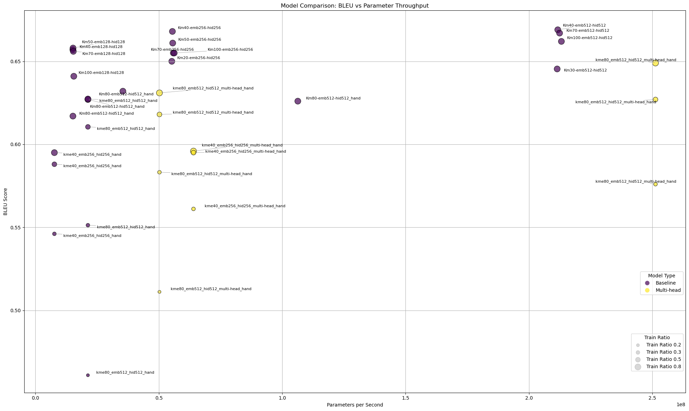

Xuanmen_Net 是一个基于 PyTorch 的先进手语翻译模型，
融合了最先进的mediapipe技术，提供高精度手语翻译能力。本仓库不仅包含推理演示，
还提供完整的训练框架，用户可轻松自定义训练自己的手语翻译模型。

主要特性：

支持手语检测，分类，翻译一体化

支持自定义训练集一键训练

优化后的轻量架构可以在边缘设备上进行快速计算

提供flask部署方案

快速开始：
<details>
<summary>✏️ 环境配置</summary>

### 克隆代码仓库并在Python3.10版本的环境中安装依赖项，请确保已安装cuda12.3及以上版本。推荐使用Python3.10.16+cuda12.3的搭配。
- 支持多级嵌套
- 显示代码、列表、图片等任意内容
```python
#克隆代码仓库
git clone https://github.com/galijiangzhi/xuanmen.git

#导航至项目目录
cd xuanmen

#安装必要的依赖库
pip install -r requirements.txt
```
</details>
<details>
<summary>✏️ 快速运行demo</summary>

### 我们提供了建议的demo用于展示结果，请确保已完成环境配置后执行以下代码运行示例程序

```python
#确保当前路径为git项目根文件夹
pwd

#导航至demo程序目录
cd demo/flask

#运行demo程序
python main.py
```


模型选择建议使用 km40-emb256-hid256_双手分离_抽帧1，
同时我们提供了一些测试视频，测试视频根路径为 'xuanmen/demo/demo_data'，
这些测试视频会在克隆代码仓库的时候一并克隆到本地。

